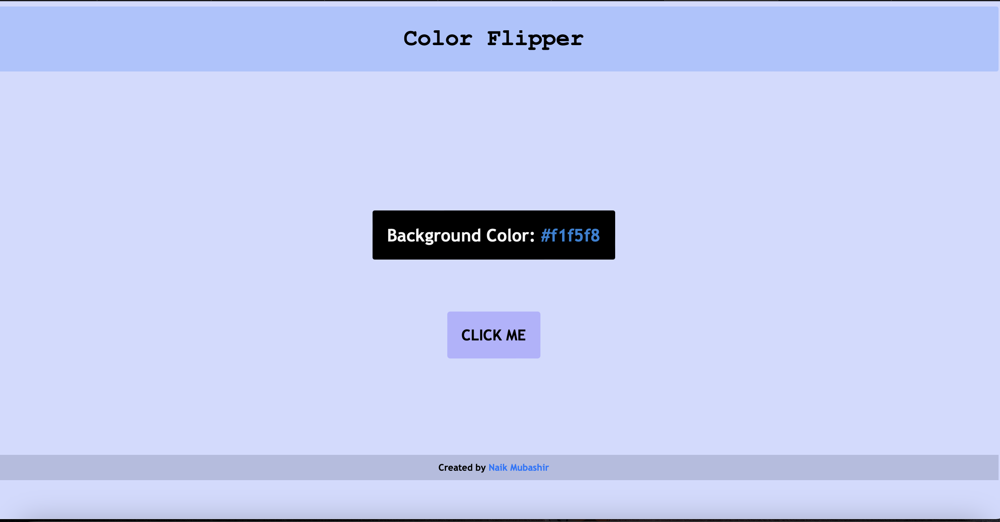

# Color Flipper

Color Flipper is a simple web application that generates and displays random colors. It can be used for design inspiration, fun, or as a tool for generating random color schemes.

## Features

- Randomly generate and display colors with a click.
- Great for design inspiration and color scheme creation.
- Easy to use and beginner-friendly.
